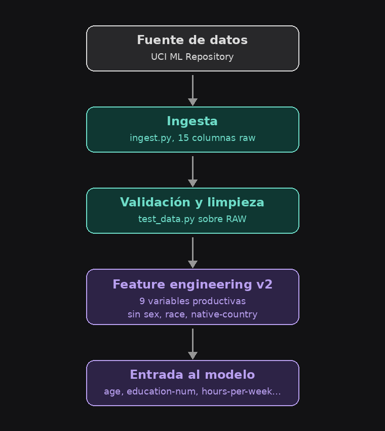
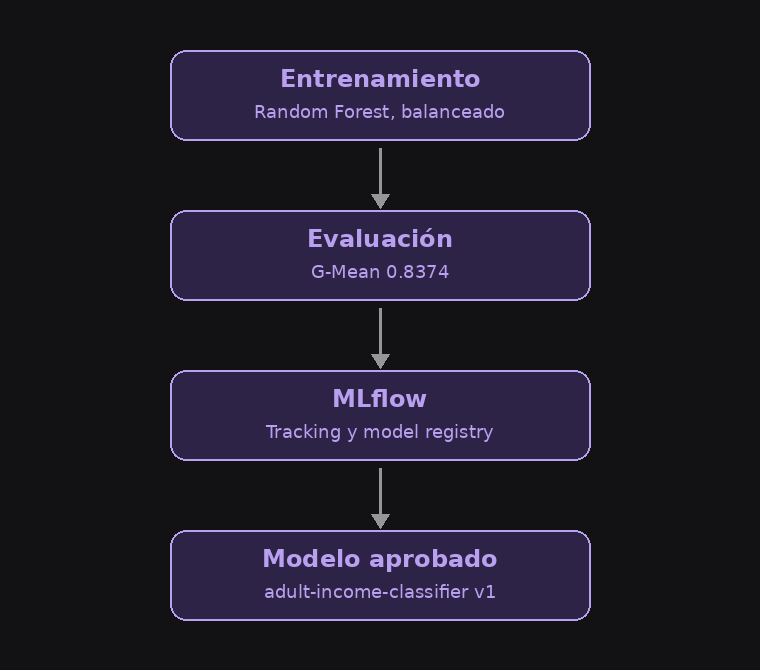
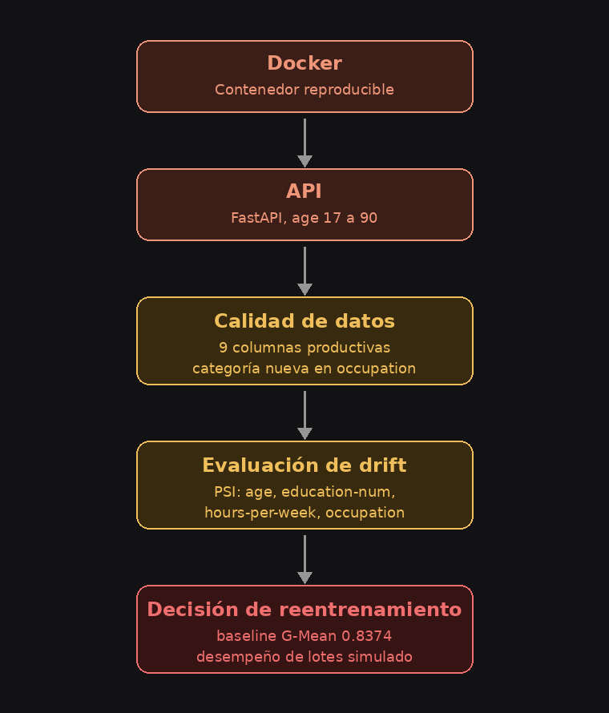

# Grupo 2 — ACI94: Predicción de Ingreso (Adult / Census Income)

> Estado: implementación de datos, modelado, API, Docker y monitoreo integrada en develop. Instalación, ingesta, limpieza y 37 pruebas verificadas en una copia limpia. Revisión documental final e integración a main pendientes.

## 1. Business Problem

El problema de negocio es **predecir si el ingreso anual de una persona supera los US$50,000**, a partir de sus características socioeconómicas y laborales (edad, ocupación, nivel educativo, horas trabajadas, estado civil, etc.).

**Pregunta de negocio:** ¿qué características socioeconómicas y laborales permiten identificar patrones asociados con personas cuyos ingresos anuales superan los US$50,000?

**Por qué es relevante:** el modelo es aplicable a análisis socioeconómico, políticas públicas, planificación educativa y de empleo, y estudios de desigualdad. El objetivo no es solo predecir, sino que el modelo sea **útil, interpretable y evaluado con responsabilidad** — no busca establecer causalidad, solo identificar patrones asociados en los datos históricos de 1994.

## 2. Dataset

**Adult / Census Income Dataset** — UCI Machine Learning Repository, extraído por Barry Becker (Censo de EE.UU., 1994).

| Característica | Descripción |
|---|---|
| Total de registros originales | 48,842 (partición original de UCI: 32,561 / 16,281) |
| Variables | 14 predictoras + 1 variable objetivo (`income`) |
| Tipo de problema | Clasificación binaria (`≤50K` vs `>50K`) |
| Balance de clases | ~76.07% `≤50K` vs ~23.93% `>50K` (desbalanceado) |

**Condiciones de extracción originales del dataset:** `(AAGE > 16) && (AGI > 100) && (AFNLWGT > 1) && (HRSWK > 0)` — representa población adulta con ciertas condiciones de participación económica/laboral, no a toda la población.

> **Nota:** el dataset crudo trae 14 variables predictoras. El modelo de producción usa un subconjunto de **9 variables** (`v2_without_sensitive`) — ver sección 7 (Training) y 11 (Monitoring) para el detalle de qué se excluyó y por qué.

El proyecto realiza una nueva partición estratificada 80/20 sobre el dataset limpio, con semilla 42. No debe confundirse con la partición original de UCI indicada arriba.

Por el desbalance de clases, la evaluación no puede basarse solo en *accuracy*; se usan G-Mean, ROC AUC, recall y especificidad. Los datos históricos no demuestran aplicabilidad a la población actual ni justifican decisiones individuales de alto impacto.

## 3. Architecture

El flujo end-to-end del proyecto se divide en 3 etapas:

### Pipeline de datos



**Alcance y aclaraciones:** la validación se implementa en `src/cleaning/data_quality_gates.py` y la limpieza en `src/cleaning/clean.py`. `tests/test_data.py` contiene pruebas, no realiza la limpieza. Los datos se guardan en `data/raw/` y `data/processed/`. Las nueve variables son entradas originales productivas, no el número de columnas después de transformar y codificar features.

### Entrenamiento y registro en MLflow



**Alcance y aclaraciones:** el diagrama resume al ganador. Se comparan Logistic Regression, Decision Tree y Random Forest mediante validación cruzada y tuning. MLflow Tracking acompaña los experimentos y la evaluación; el Registry identifica después al modelo aprobado, versión 1, alias `production`.

### Producción y monitoreo



**Alcance y aclaraciones:** Docker contiene la API, que carga el artefacto local de `models/production/`. Las flechas son conceptuales: una solicitud HTTP no ejecuta automáticamente los scripts de calidad, drift y reentrenamiento. `/metrics` expone métricas operativas; los scripts de datos evalúan batches simulados y `model_performance.py` evalúa batches etiquetados. La decisión combina drift y deterioro del desempeño, sin ejecutar entrenamiento automático. No existe una orquestación automática completa de estos módulos.

Cada componente del diagrama corresponde a código real del repositorio: `src/ingestion/`, `src/cleaning/`, `src/features/`, `src/training/`, `src/api/`, y `src/monitoring/`.

## 4. Repository Structure
```
.
├── data/
│   ├── raw/            # datos crudos (no versionados, ver .gitignore)
│   └── processed/       # datos procesados (no versionados)
├── notebooks/            # EDA y notebooks exploratorios
├── docs/architecture/     # diagramas de arquitectura
├── documentacion/        # guías de uso y análisis del modelo
├── frontend/             # interfaz Streamlit
├── models/production/    # artefacto MLflow aprobado para inferencia
├── src/
│   ├── ingestion/        # script de ingesta reproducible
│   ├── cleaning/         # limpieza y validación de datos
│   ├── features/         # feature engineering reutilizable
│   ├── training/          # entrenamiento y tracking en MLflow
│   ├── api/               # API de inferencia (FastAPI)
│   └── monitoring/        # monitoreo de datos, modelo y sistema
├── tests/                 # pruebas de datos, modelo, API y monitoreo
├── Dockerfile
├── requirements.txt
├── .gitignore
└── README.md
```

## 5. Installation

Ejecutar desde la raíz del repositorio. Se requiere acceso al repositorio privado, Python compatible con `requirements.txt` y Docker Desktop para la prueba en contenedor. El entorno del equipo fue validado con Python 3.14. No es necesario reentrenar para utilizar el artefacto productivo incluido.

PowerShell (Windows):

```powershell
git clone https://github.com/mariadetodosloangeles333-ai/-grupo2-aci94-mlops.git aci94-repo
cd aci94-repo
python -m venv .venv
.\.venv\Scripts\Activate.ps1
python -m pip install -r requirements.txt
```

En Linux/macOS, activar el entorno con `source .venv/bin/activate`.

## 6. Data Ingestion

Script reproducible en `src/ingestion/ingest.py`. Descarga el dataset directamente desde el UCI ML Repository (paquete `ucimlrepo`, `id=2`) — no depende de un CSV guardado a mano en ninguna computadora.

El script:

1. Descarga features + target desde UCI.
2. Une ambos en un único dataframe crudo (`income` como columna objetivo).
3. Valida el mínimo esperado: al menos 48,000 filas y 15 columnas (14 features + `income`).
4. Guarda el resultado en `data/raw/adult_raw.csv`, con un log de la ingesta en `logs/ingestion.log`.

Correr:
```bash
python src/ingestion/ingest.py
```

## 7. Training

### Preparación y features

Después de la ingesta, ejecutar la limpieza:

```bash
python src/cleaning/clean.py
```

Lee el archivo crudo, aplica gates de referencia y del resultado limpio, trata valores categóricos faltantes y elimina duplicados. Guarda `data/processed/adult_clean.csv` sin reemplazar el archivo crudo.

`src/features/build_features.py` implementa `v1_baseline` y `v2_without_sensitive`. Esta última excluye `sex`, `race` y `native-country` como predictores directos. Se conservan variables sensibles para auditoría; excluirlas no garantiza ausencia de sesgo, porque pueden existir proxies.

Las nueve entradas productivas son `age`, `education-num`, `hours-per-week`, `capital-gain`, `capital-loss`, `workclass`, `marital-status`, `occupation` y `relationship`. `education` se excluye por redundancia con `education-num`; `fnlwgt` se excluye por su naturaleza de peso muestral. Las variables de capital generan indicadores de presencia y transformaciones logarítmicas. El pipeline guardado se reutiliza en inferencia.

Los datos de entrenamiento de v2 pueden conservar `education` y `fnlwgt` antes de que el pipeline las descarte. Por eso la firma histórica puede mostrar once columnas mientras la API recibe nueve; son capas de entrada diferentes.

Ejecutar `python src/features/build_features.py` es un smoke test opcional del pipeline, no un paso que genere un archivo obligatorio para entrenar. En entrenamiento, los transformadores se ajustan dentro de cada fold de entrenamiento.

### Comparación y selección

La partición es estratificada 80/20, semilla 42, con validación cruzada estratificada de cinco folds sobre entrenamiento. Las predicciones OOF se obtienen para cada observación con un modelo que no la utilizó para ajustarse en ese fold.

El modelo de producción es un **Random Forest** con `class_weight="balanced"` (para compensar el desbalance de clases del dataset, ~76% ≤50K vs ~24% >50K), entrenado sobre el conjunto de features **`v2_without_sensitive`** (9 variables productivas, ver sección Feature Engineering en `src/features/build_features.py`).

**Métrica principal: G-Mean** (media geométrica de sensibilidad y especificidad), preferida sobre accuracy por el desbalance de clases.

Resultados del modelo aprobado (test set):

| Métrica | Valor |
|---|---|
| G-Mean | 0.8374 |
| ROC AUC | 0.9219 |
| Recall | 0.8660 |
| Especificidad | 0.8098 |

Ver comparación completa entre modelos en la sección 12 (Results).

Correr:
```bash
python src/training/train.py
```

## 8. MLflow

### Reproducción del tuning y la evaluación

Después de `train.py`, una nueva búsqueda se ejecuta con:

```bash
python src/training/tune.py
```

Estos comandos crean nuevos runs y pueden tardar varios minutos. No son necesarios para probar la API existente.

`evaluate.py` reconstruye el Random Forest seleccionado con hiperparámetros fijados en `build_selected_pipeline()`: 150 árboles, profundidad 20, mínimo 5 muestras para dividir, mínimo 2 por hoja, `max_features="sqrt"`, balanceo de clases y semilla 42. No selecciona automáticamente al ganador de una nueva búsqueda. Contiene `SELECTED_TUNING_RUN_ID` y `VALIDATION_G_MEAN` del experimento histórico.

Para una nueva selección, revisar los resultados de CV y actualizar de forma coherente modelo, hiperparámetros, referencia e ID antes de evaluar el test reservado:

```bash
python src/training/evaluate.py
```

Este comando entrena y registra una nueva evaluación. No se debe usar el test para seguir ajustando hiperparámetros. Los criterios codificados son G-Mean mínimo 0.80, recall y especificidad mínimos 0.75 y diferencia absoluta de G-Mean validación-test máxima 0.03.

### Seguimiento de experimentos

Cada corrida de entrenamiento se registra como un run en MLflow, con parámetros (algoritmo, hiperparámetros, `feature_set_version`, semilla), métricas (G-Mean, ROC AUC, Recall, Especificidad) y artefactos (modelo, matriz de confusión, configuración).

El modelo aprobado quedó registrado en el **Model Registry**:

- Nombre: `adult-income-classifier`
- Versión: `1`
- Alias: `production`
- Run final: `11c8bc44969d40938763b78ead476dfd`

Experimento: `adult-income-classification`. Los metadatos se guardan en `mlflow.db` y los artefactos en `mlartifacts/`. Desde la raíz del proyecto, abrir la misma base:

```bash
mlflow ui --backend-store-uri sqlite:///mlflow.db --port 5000
```

Abrir `http://127.0.0.1:5000`. Una base nueva no contiene los runs históricos. Copiar solo la base tampoco garantiza que las rutas de artefactos sean accesibles en otra computadora.

### Registro y promoción

`register_model.py` valida el run de origen, registra o recupera su versión, valida el candidato y lo promueve mediante alias. `FINAL_RUN_ID` está fijado al run histórico. En una base nueva debe apuntar al nuevo run final aprobado y existente antes de ejecutar:

```bash
python src/training/register_model.py
```

Este comando modifica el Registry y puede cambiar el alias `production`. La versión asignada puede diferir de 1. No ejecutarlo como una simple prueba de la API.

**Límite de despliegue:** promover un alias no actualiza automáticamente `models/production/`. La API carga esa copia local y tiene metadatos de versión fijos. Desplegar otra versión requiere exportar el artefacto aprobado, actualizar los metadatos coherentemente, validar y reconstruir la imagen. Ese paso no está automatizado por `register_model.py`.

## 9. Docker
```bash
docker build -t grupo2-aci94-mlops .
docker run -p 8000:8000 grupo2-aci94-mlops
```
La imagen ejecuta la API correctamente; el contenedor fue probado de punta a punta (`docker build` + `docker run` + request real a `/predict`).

## 10. API

Servida con **FastAPI**, cargando la carpeta MLflow `models/production/` mediante `mlflow.sklearn.load_model()`. Incluye `MLmodel`, `model.pkl` y archivos auxiliares. Endpoints disponibles:

- `GET /health` — healthcheck del servicio.
- `GET /model-info` — versión y metadatos del modelo cargado.
- `GET /metrics` — métricas operativas del proceso.
- `POST /predict` — predicción sobre las **9 variables productivas**: `age`, `education-num`, `hours-per-week`, `capital-gain`, `capital-loss`, `workclass`, `marital-status`, `occupation`, `relationship`. El campo `age` se valida en el rango **17–90**, el mismo rango usado en la simulación de Monitoring.

Ejemplo de request de `POST /predict`:

```json
{
  "age": 35,
  "education-num": 13,
  "hours-per-week": 40,
  "capital-gain": 0,
  "capital-loss": 0,
  "workclass": "Private",
  "marital-status": "Never-married",
  "occupation": "Prof-specialty",
  "relationship": "Not-in-family"
}
```

Ejemplo ilustrativo del formato de respuesta (no es el resultado garantizado del request anterior):
```json
{
  "prediction": "<=50K",
  "probability": 0.12,
  "model_version": "1"
}
```

`probability` siempre corresponde a `>50K`, no necesariamente a la clase predicha. Una entrada válida devuelve HTTP 200. Cambiar `age` a 10 genera HTTP 422: el rango permitido es 17–90.

Documentación interactiva en `http://localhost:8000/docs`. Para ejecutar sin Docker:

```bash
python -m uvicorn src.api.main:app --host 127.0.0.1 --port 8000
```

No ejecutar esta opción y Docker simultáneamente en el mismo puerto.

## 11. Monitoring

Se distinguen tres dimensiones: **sistema, datos y desempeño del modelo**. Calidad y drift operan sobre entradas productivas; desempeño utiliza etiquetas, predicciones y probabilidades; sistema utiliza solicitudes HTTP. Los scripts de simulación son independientes y no se ejecutan automáticamente después de cada solicitud.

### 11.1 Drift Detection (`src/monitoring/drift_detection.py`)

Se construyó un **reference/baseline** (40% del dataset histórico) y 3 lotes de "producción" simulados a partir del mismo dataset, cada uno con una magnitud de cambio distinta:

| Lote | Descripción | PSI máximo | Estado |
|---|---|---:|---|
| Lote 1 (normal) | Sin alteraciones intencionales | 0.0027 | OK |
| Lote 2 (moderado) | Cambio moderado en entradas | 0.1529 | WARNING |
| Lote 3 (fuerte) | Cambio grande en la población de entrada | 3.6700 | ALERT |

El script imprime el PSI y estado de cada lote. Para la evidencia final se debe conservar la salida de la versión integrada, sin mezclar cifras de versiones anteriores.

**Métrica usada:** PSI (Population Stability Index).
- Numéricas monitoreadas: `age`, `education-num`, `hours-per-week`
- Categórica monitoreada: `occupation` (en lugar de `education`, que no es una entrada productiva)

**Umbrales heurísticos adoptados para la simulación:**

- `PSI < 0.10` → cambio bajo → **OK**
- `0.10 ≤ PSI < 0.25` → cambio moderado, vigilar de cerca → **WARNING**
- `PSI ≥ 0.25` → cambio fuerte, la distribución cambió → **ALERT**

Se usan para separar niveles de intervención. No son leyes universales ni pruebas de significancia estadística. En producción deben calibrarse con la variación de referencia, tamaño de los batches y costos de falsas alertas. Una alerta de drift no demuestra por sí sola deterioro del modelo.

El rango de `age` en la simulación está alineado con el que valida la API: **17 a 90 años**.

Correr:
```bash
python src/monitoring/drift_detection.py
```

### 11.2 Data Quality Gates (`src/monitoring/data_quality_gates.py`)

Se simula contaminación **sobre una copia** de un batch (nunca se modifica `data/raw/` ni `data/processed/`), introduciendo 6 problemas típicos de producción:

1. Missing values (`occupation`)
2. Filas duplicadas
3. Outlier extremo (`age = 999`)
4. Tipo de dato incorrecto (`age = "treinta"`)
5. Categoría desconocida en `occupation`
6. Cambio de esquema (columna nueva no esperada)

Las validaciones corren sobre las **9 columnas productivas** (no las 15 de RAW), y detectan tanto **columnas faltantes** como **columnas extra** no esperadas en el esquema. La prueba de "categoría desconocida" se hace sobre `occupation` (variable que sí llega a producción), no sobre `native-country`, que quedó excluida en la versión productiva.

El pipeline sigue el flujo: **Detecta → Bloquea/Advierte → Registra**. Los problemas críticos (esquema, tipo de dato, rango) bloquean el batch; los demás generan advertencia. Todo queda registrado en `logs/data_quality_incidents.log`.

Correr:
```bash
python src/monitoring/data_quality_gates.py
```

### 11.3 Decisión de reentrenamiento (`src/monitoring/retraining_decision.py`)

Combina la señal de drift (PSI) con el desempeño del modelo, medido con **G-Mean**, para decidir entre **MANTENER**, **REVISAR** o **CONSIDERAR REENTRENAMIENTO**, partiendo de la premisa de que **Drift ≠ Model Degradation**: un cambio en la distribución de los datos no implica automáticamente que el modelo esté fallando.

El G-Mean aprobado de Production v1 es **0.8374** (`PRODUCTION_G_MEAN`).

| Escenario | Drift | Desempeño simulado | Decisión |
|---|---|---|---|
| Lote 1 | Sin drift | Estable | MANTENER |
| Lote 2 | Drift moderado | Estable | REVISAR |
| Lote 3 | Drift fuerte | Se deterioró | CONSIDERAR REENTRENAMIENTO |

El deterioro sin drift relevante también requiere revisión. La lógica no ejecuta un pipeline de entrenamiento ni consulta automáticamente el módulo de desempeño: combina las señales suministradas. Los umbrales requieren revisión según el contexto de uso.

> **Nota:** los valores de G-Mean usados para los lotes de ejemplo son **simulados** con fines demostrativos — no provienen de una evaluación real del modelo sobre datos de producción etiquetados. Solo se recomienda reentrenar cuando **ambas** señales (drift relevante + caída de G-Mean) aparecen juntas.

Correr:
```bash
python src/monitoring/retraining_decision.py
```

**Límite de interpretación:** detectar drift y deterioro simultáneamente justifica investigar y considerar reentrenamiento, pero no demuestra que el drift haya causado la caída. Asimismo, no detectar drift en las variables monitoreadas no descarta cambios en otras variables o en la relación entre entradas y objetivo. Las explicaciones de la demo deben interpretarse con estas limitaciones.

### 11.4 System Monitoring

El middleware de `src/api/main.py` contabiliza solicitudes, errores HTTP 4xx/5xx y latencia. `/metrics` se excluye de sus propios contadores.

| Campos | Interpretación |
|---|---|
| `availability_status`, `uptime_seconds` | Estado actual y tiempo activo del proceso |
| `total_requests`, `successful_requests`, `error_requests` | Contadores de solicitudes |
| `error_rate` | Errores / solicitudes contabilizadas |
| `throughput_requests_per_second` | Solicitudes / tiempo activo; promedio acumulado |
| `average_latency_ms`, `last_latency_ms` | Latencia media y última latencia |

Son métricas en memoria, por proceso, que se reinician con el servicio. La disponibilidad histórica y la agregación de múltiples procesos requieren herramientas externas. El endpoint no registra los periodos en que el servicio estuvo caído.

Consulta en PowerShell, con la API activa:

```powershell
Invoke-RestMethod -Uri "http://localhost:8000/health"
Invoke-RestMethod -Uri "http://localhost:8000/metrics"
```

### 11.5 Model Monitoring

`src/monitoring/model_performance.py` reutiliza las métricas de entrenamiento para evaluar batches con etiquetas reales disponibles, predicciones y probabilidades de `>50K`. Devuelve ID del batch, fecha UTC, tamaño, precision, recall, especificidad, F1, G-Mean y ROC AUC. No implementa por sí solo almacenamiento histórico persistente.

Compara el G-Mean con el baseline 0.8374 y una caída absoluta de 0.05. Valida batches no vacíos, longitudes iguales, etiquetas reales no faltantes y presencia de ambas clases. La demo utiliza etiquetas, predicciones y probabilidades simuladas; no mide tráfico real ni utiliza el test reservado.

```bash
python src/monitoring/model_performance.py
```

| Batch ilustrativo | G-Mean | ROC AUC | Caída de G-Mean | Deterioro |
|---|---:|---:|---:|---|
| Estable | 0.8000 | 0.9600 | 0.0374 | No |
| Deteriorado | 0.4899 | 0.6200 | 0.3475 | Sí |

Los batches pequeños demuestran la lógica, no constituyen una estimación robusta del desempeño productivo.

### 11.6 Pruebas automatizadas

Preparar antes los datasets mediante ingesta y limpieza y disponer del artefacto productivo y las dependencias:

```bash
python -m pytest -q
```

La suite cubre esquema, tipos, rangos, missing y columnas obligatorias; carga y predicción del modelo; respuesta de API válida y HTTP 422; métricas operativas; calidad, drift, desempeño etiquetado y decisiones de reentrenamiento.

Validación realizada sobre una copia limpia de develop, commit f6dee34, con Python 3.14.6 y un entorno virtual nuevo: instalación de dependencias sin incompatibilidades declaradas, ingesta y limpieza completadas, y 37 pruebas aprobadas con dos advertencias de deprecación y ningún fallo. En las comprobaciones anteriores también se verificaron Docker, API, métricas operativas y simulaciones de calidad, drift y desempeño.

## 12. Results


### Comparación de modelos ajustados

La selección del modelo se realizó con **validación cruzada** sobre el conjunto de entrenamiento, usando **G-Mean** como métrica principal debido al desbalance de clases. El conjunto de test no se utilizó para seleccionar el modelo.

| Modelo | G-Mean CV | Desv. CV | G-Mean OOF | F1 CV | Recall CV | Especificidad CV | ROC AUC CV |
|---|---:|---:|---:|---:|---:|---:|---:|
| Logistic Regression | 0.8221 | 0.0072 | 0.8221 | 0.6800 | 0.8490 | 0.7960 | 0.9058 |
| Decision Tree | 0.8214 | 0.0049 | 0.8215 | 0.6747 | **0.8661** | 0.7792 | 0.9043 |
| **Random Forest** | **0.8338** | 0.0058 | **0.8338** | **0.6990** | 0.8529 | **0.8151** | **0.9186** |

**Random Forest** fue seleccionado porque obtuvo el mayor G-Mean promedio de validación y OOF, junto con el mejor F1, especificidad y ROC AUC. Aunque Decision Tree presentó un recall ligeramente mayor, su especificidad y equilibrio general entre clases fueron inferiores.

### Evaluación final del modelo seleccionado

Después de seleccionar Random Forest mediante validación cruzada, el modelo fue evaluado **una única vez** sobre el conjunto de test reservado:

| Métrica | Resultado |
|---|---:|
| G-Mean | 0.8374 |
| F1 | 0.7011 |
| Recall | 0.8660 |
| Especificidad | 0.8098 |
| ROC AUC | 0.9219 |
| Diferencia absoluta validación-test | 0.0036 |

La diferencia reducida entre validación y test (0.0036) es compatible con un desempeño similar en ambas particiones; por sí sola no demuestra ausencia de sobreajuste ni garantiza generalización a otras poblaciones.

MLflow almacenó criterios de selección y validación, matriz de confusión, curva ROC, importancia de variables y resultado de validación final. Estos artefactos apoyan la auditoría junto con código, datos, dependencias y metadatos de ejecución.

El modelo fue registrado en MLflow Model Registry con el nombre `adult-income-classifier`; la versión `1` recibió el alias `production`, identificándola como la versión aprobada para el servicio de inferencia (ver sección 8, MLflow).

El [análisis detallado del modelo](documentacion/model_evaluation.md) incluye la matriz de confusión, las métricas de los subgrupos Female y Male y las limitaciones de interpretación.

## 13. Team

- Vladimir
- Naomi
- Dalay (Maria Angeles)

### Git workflow y cierre de entrega

El flujo de integración es rama de trabajo → PR hacia `develop` → revisión y pruebas → PR de `develop` hacia `main`. Se concilian los cambios pendientes sin perder contenido; no se sustituyen estos pasos fusionando features directamente en `main`.

Antes de entregar: completar la revisión documental e integrar develop a main mediante PR. Confirmar también que el informe técnico, la presentación y la demo de defensa estén preparados.
